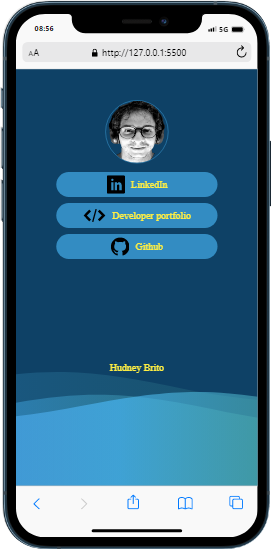

# SocialLinks

Esse é um projeto pessoal para que tanto servirá para meus contatos quanto para meu portifólio

## Índice

- [Visão geral](#visão-geral)
  - [O desafio](#o-desafio)
  - [Captura de tela](#captura-de-tela)
- [Meu processo](#meu-processo)
  - [Construído com](#construído-com)
  - [Desenvolvimento contínuo](#desenvolvimento-contínuo)
- [Autor](#autor)
- [Agradecimentos](#acknowledgments)

## Visão geral

### O desafio

O usuário irá:

- Acessar a diferentes links de contatos ou produtos que estarão armazenados em um único local.

### Captura de tela

## Meu processo

### Construído com

- Marcação HTML5
- Propriedades personalizadas CSS
- Flexbox

### Desenvolvimento contínuo

  - Deixei espaço para aprimorar e colocar dinamismo com uma liguagem de programação.

## Autor

- Website - [Hudney Brito](https://hudney-fsbrito.github.io/Hudney-Brito-Portfolio-/)
